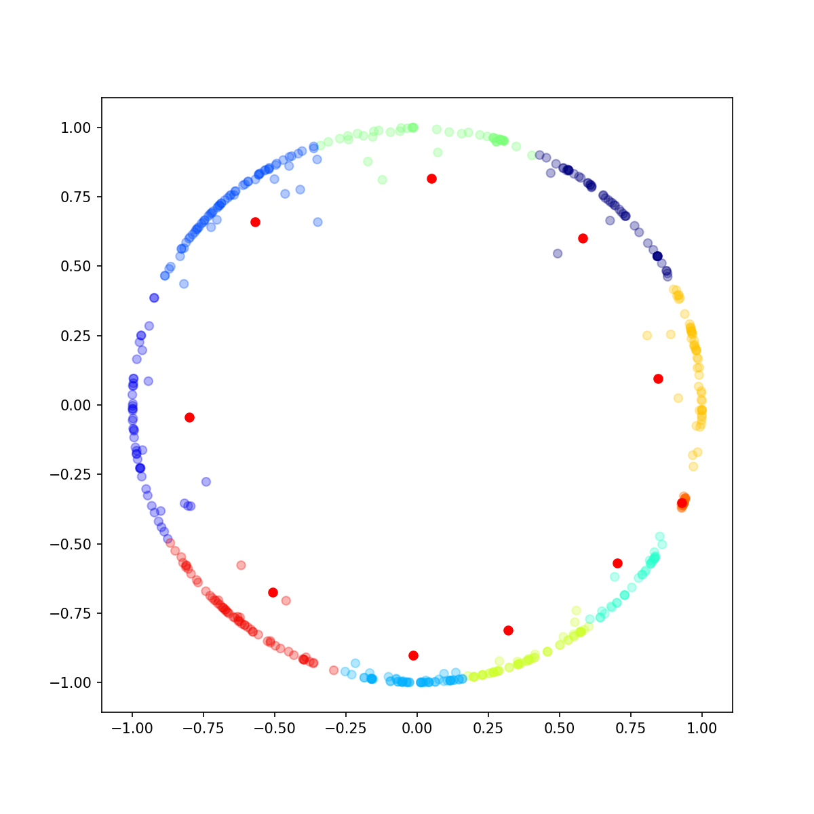

# PoincareKMeans: K-Means algorithm in the Poincare Disk Model

This a simple K-Means algorithm for clustering points in the Poincare Disk Model, a model for hyperbolic space.
This package was develop to exploit the results of Nickel & Kiela's *Poincare Embeddings* (as described in the paper
[Poincaré Embeddings for Learning Hierarchical Representations](https://papers.nips.cc/paper/7213-poincare-embeddings-for-learning-hierarchical-representations)).

This code has not been optimized. All contributions (for example for optimizing it for large sample sizes) are welcome.

## Usage

The API follows closely that of [scikit-learn K-Means](https://scikit-learn.org/stable/modules/generated/sklearn.cluster.KMeans.html).
A model is obtained by importing and instantiating PoincareKMeans

  >>> model = PoincareKMeans()

The options are as follows.

  * *n_clusters (default 8)*: number of clusters to be determined
  * *n_init (default 20)*: number of time the k-means algorithm will be run with different centroid seeds.
  * *max_iter (default 300)*: maximum number of iterations of the k-means algorithm for a single run.
  * *tol (default 1e-8)*: tolerance criteria to declare convergence for each run.
  * *verbose (default True)*: verbosity mode. If True, will display the best inertia obtained for each run.

The model is trained on the dataset using *fit*

    >>> model.fit(X)

Additional methods are provided:
  * *fit_predict*: compute centroids and predict cluster index for each sample.
  * *fit_transform*: compute clustering and transform X to cluster-distance space.
  * *predict*: predict cluster index for the given sample.
  * *transform*: computer cluster-distance for the given sample.

## Example

An example, using some coordinates obtained by Nickel & Kiela's embedding algorithm, is provided.
The output should be analog to the following Figure.

